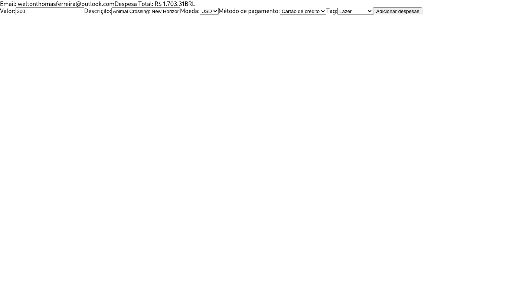

# Trybe Project Trybewallet 16/10/2021
 

  
  
  

 

## Habilidades

- Criar um store Redux em aplicações React;
- Criar reducers no Redux em aplicações React;
- Criar actions no Redux em aplicações React;
- Criar dispatchers no Redux em aplicações React;
- Conectar Redux aos componentes React;
- Criar actions assíncronas na sua aplicação React que faz uso de Redux.

## Desenvolvimento
Uma [carteira](https://weltonthomasferreira.github.io/trybe-project-trybewallet/#/) de controle de gastos com conversor de moedas.

## Resultados

- `3` dias de projeto;
- `11` requisitos;
- Percentual de cumprimento de requisitos obrigatórios `80.00%`;
- Percentual de cumprimento de requisitos totais `72.73%`.
